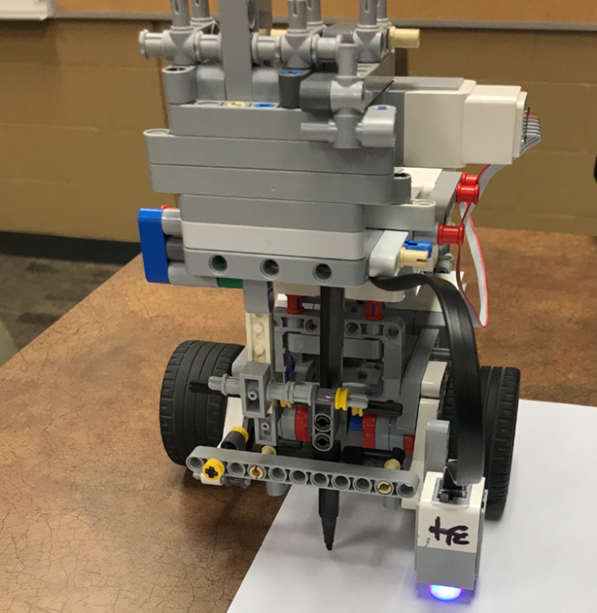

# Morse_Code_Translator

For our final course project (MTE 121: Digital Computation), we built a robot that can draw and read morse code. 

## Robot Tasks

1. Waits for left or right button input 
2. If left button is pressed, the robot drives forward until reaches black for the first time 
3. Starts reading the morse code (each letter that is read is displayed to the screen)
4. Stops reading when reaches red 
2. If right button is pressed, the robot opens and reads the uploaded file (userword.txt)
3. Translates the given word to morse code through the arrays
4. Draws out the morse code using 1 cm increments (1 cm for a dot , 3 cm for a dash, 1 cm between dots and dashes in the same letter, 3 cm between letters 
5. Stops when done writing 
6. If the enter button is pressed at any point in time, the shutdown procedure will activate.  

## Roles & Responsibilities

Olivia:  
• `void moveRobotForwardWhenDrawing(char * currCode)`  
• `void letterMatch(char * userWord, int wordSize)`  
• `void travelPen(int PEN_MOTOR_POWER)` 

Mridul:  
• `void shutdownCheck()`  
• `int pathDecision()`  
• `void travel (int motorPower, int dist)` 

Krish:  
• `void readMorseCode()` 

Rijin:  
• `int readFromFile(char * updateWord)` 

## How to change file input & draw new words each time
Once the robot is connected to Robot-C, click on `Robot` then `Lego Brick`.
Navigate to the file management utility and upload the file `userWord.txt` with the new changes.
Ensure that you have typed the number of characters in the word before typing the word itself.

## Code

The robot was programmed using Robot C (The syntax is very similar to C++).

## Further Improvements
• Add new features such as the robot's ability to listen to morse code using sound level sensors and timers or 
  being able to input morse code through taps with a touch sensor and a timer
  
• Currently, the robot draws morse code based on a word provided in English. To improve the robot, we can have the file input provided in
  multiple languages so that the robot is capable of translating and drawing words given in multiple languages.
